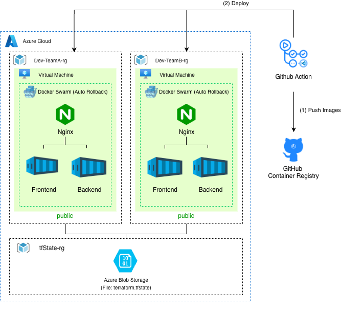
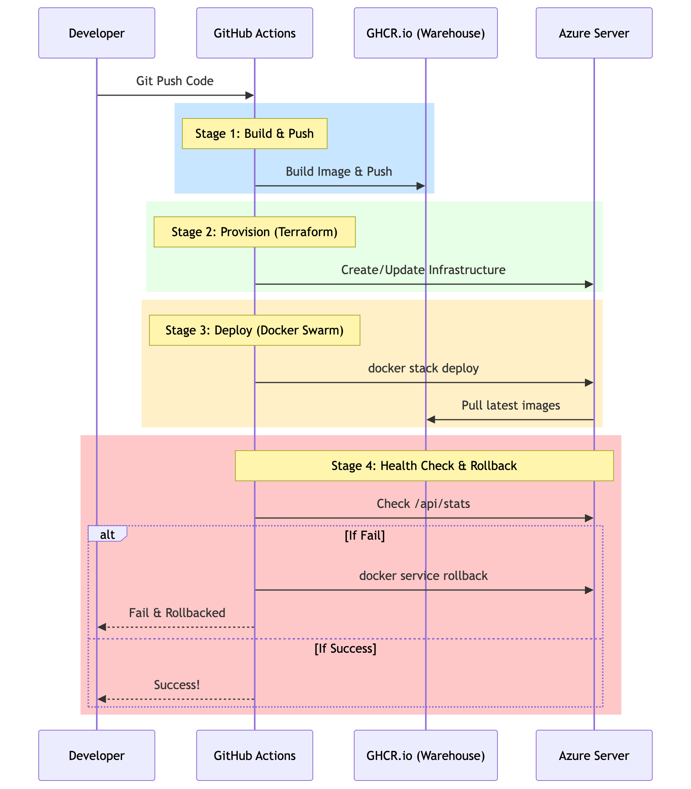

# 🛡️ Stark Hero Hub: Platform Engineering
Welcome to the standardized internal platform for deploying **Suit Analysis** applications. This repository provides a "Golden Path" for engineers to provision, configure, and deploy secure infrastructure automatically.

## 🚀 New Team Onboarding
If your team is assigned to develop a new Suit Analysis app, follow these steps to get started:

### 1. Template Initialization
- Click the **"Use this template"** button to create your own repository.
- Navigate to `terraform/variables.tf` and update the `project_name` variable to your team's specific name (e.g., `stark-mark-42`).
  > [!IMPORTANT]
  > Using a unique `project_name` prevents resource naming collisions when multiple teams deploy to the same Azure subscription.

### 2. Security Configuration (GitHub Secrets)
Go to `Settings > Secrets and variables > Actions` and add the following secrets:
- `AZURE_CREDENTIALS`: Azure Service Principal JSON (Request from the Platform Team).
- `SSH_PUBLIC_KEY`: The public key to be injected into the VM.
- `SSH_PRIVATE_KEY`: The private key used by GitHub Actions for application deployment.
- `AZURE_STORAGE_ACCESS_KEY`: (Optional) For remote Terraform state management.

### 3. Application Preparation
- Place your Backend/Frontend code inside the `/app` directory.
- **Requirement:** Your application must listen on **Port 80** and provide a health check endpoint (e.g., `/`) for the **Auto-Rollback** mechanism to function.

### 4. Deployment & Monitoring
- Simply **`git push origin main`** to trigger the automated 4-stage pipeline:
  1. **Build:** Container images are built and pushed to GHCR.
  2. **Provision:** Infrastructure is created/updated via Terraform.
  3. **Harden:** Security baseline and Docker runtime are applied via Ansible.
  4. **Deploy:** Application is deployed using **Nginx Reverse Proxy** and **Docker Swarm**.
- **Zero-Downtime Rollback:** We use a dual-layer rollback system:
  - **Native Swarm Check:** Docker monitors the container's `/health` endpoint during the update.
  - **GHA External Check:** GitHub Actions verifies the platform's accessibility from the outside. If either fails, the system automatically triggers a `docker service rollback`.

---

## 📊 System Architecture

---

## ⚙️ CI/CD Pipeline Workflow

---

## 💰 Resource Cost Breakdown (Target: $0)
To comply with the CTO's zero-budget mandate, we utilize the following **Azure Free Tier** resources:

| Resource | Service Type | Size/SKU | Estimated Cost | Free Tier Logic |
| :--- | :--- | :--- | :--- | :--- |
| **Compute** | Linux VM | Standard_B1s | $0.00 | Free for 12 months (750 hrs/mo) |
| **Storage** | Managed Disk | 64GB (P6) | $0.00 | Free for 12 months (2x disks) |
| **IP Address** | Public IP | Basic/Standard | $0.00 | Free while VM is running |
| **Network** | VNET/NSG | Standard | $0.00 | Included with Subscription |
| **Security** | UFW/Ansible | - | $0.00 | Open Source / No License Cost |
| **Total** | | | **$0.00 / mo** | |

---

## 🏗️ Platform Components
- `terraform/`: **Infrastructure as Code** (IAC) for automated network and server provisioning.
- `ansible/`: **Configuration Management** for security hardening and runtime installation.
- `app/`: Standardized containerized application structure.
- `.github/workflows/`: Full CI/CD Pipeline with **Automated Rollback** logic.

## 🛡️ Mandatory Policies
1. **100% IAC:** Manual changes via the Azure Console are strictly prohibited. All changes must be defined in Terraform.
2. **Standardized Naming:** All resources MUST be prefixed with the `project_name` to ensure isolation.
3. **Immutable Deployments:** No manual SSH patching. Every update must go through the CI/CD pipeline.

